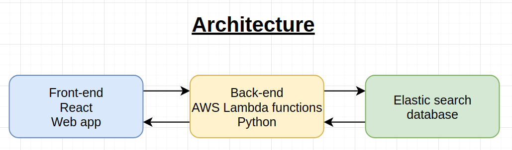
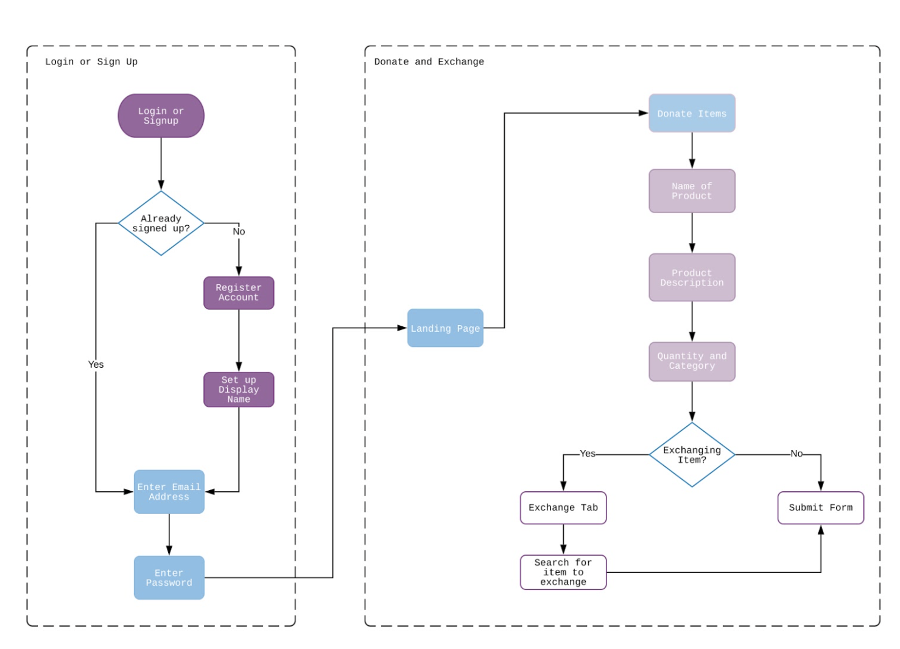

# Releaf （Resource Sharing Website with Accenture)

## Goals:

To create a web app to allow users to share and receive items in times of hardship.

## Frontend:
- React

## Backend: 
- Python AWS Lambda
- Elasticsearch
- Kibana 

## Problem Statement:
During times of crisis, fear takes hold of populations, causing individuals to make decisions that are not considered rational, throwing imbalance into markets for resources that cannot be fixed at a large scale quickly. The result of this imbalance often ends with some having more than they need, while others are lacking in fundamental items to complete daily activities. Understanding this problem space, allowed us to come up with a problem statement of “In the context of an irrational economy, how can we ensure that individuals can easily share and obtain resources during these adverse times to ultimately serve and help their community out?”

## Software Architecture:
There are 2 main layers, the frontend visualizing components, and the AWS Infrastructure components, which ultimately supports the backend code and database. 
The website frontend is written  in pure react and hosted on AWS amplify. The website is given an endpoint url that directs requests to the AWS API gateway. 
This particular API Gateway then forwards the requests to Python Lambda functions that interact with the Elasticsearch database. 
Another feature  is uploading an image, we used the AWS s3 bucket to store that particular file and fetch back to the frontend. 
AWS also provides Kibana as a service to visualise the data. This is handy to perform data analysis, analytics, as well as generate valuable data for organisations. 
For example, we can generate currently in-demand products, locations in short supply of products and demographics information to name a few. 
There are 3 main layers, the code, the AWS Infrastructure and the interface layers. The frontend is written in React and hosted on AWS Amplify. This app is given an endpoint url that directs requests to the AWS API gateway. 

## Solution 
Target Users, User Flow, Motivation for product, Research and Validation

## Research
In conducting our research to gain a better understanding of similar resource-sharing platforms, we looked into prime examples such as Ebay, Amazon, and Gumtree.
Main sources of avenue:
charging a commission between buyer and seller when a transaction is made
offering promotion services to a seller’s listing.

## Our solution:
we provide a market opportunity for those struggling in the COVID pandemic, who are lacking essential day to day needs.
As with COVID, it is observed that there will always be a small group of individuals who will take more than they require out of this fear, leaving many others with an inadequate supply to pass the crisis. Like the infamous toilet paper hoard of 2020.

## Why you should invest in our product:
Our platform specifically targets times of hardships, such as pandemics and crisis relief, rather than general resource sharing.
In such hardships, there are many gaps in the market resulting in short supply of necessary needs.
We intend to minimise these struggles for future crisis, and establish a sense of kinships within the community.
We tap into people’s moral goodness to fulfil the aim of our website
Will not charge heavier commissions on transactions like pre existing platforms
Promote moral deeds and actions that benefit the community
platform can be easily marketed as a moral platform
implies positive themes and attracts sponsors or advertisers.

## Product
A Resource sharing software in the form of a website

Users can:
Post or trade items
Exchange items for other products they need
Limit searches to specific categories or areas

USER FLOW
All searchables items are available on landing page. However to Donate the user goes through a process of:
Registering an account
Email address, password, display name
Donate
Name
Description
Quantity
Postcode
Submit form

